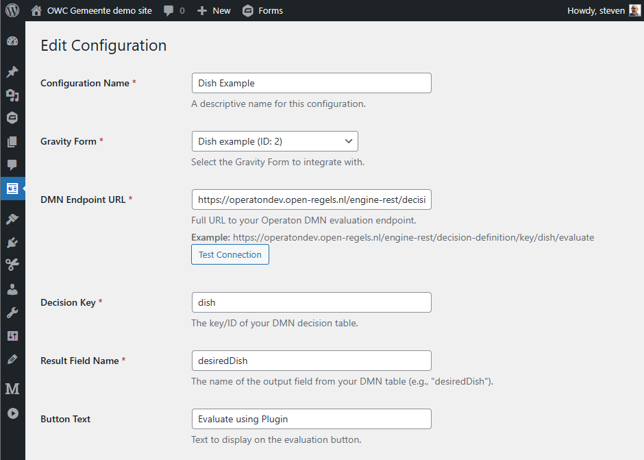
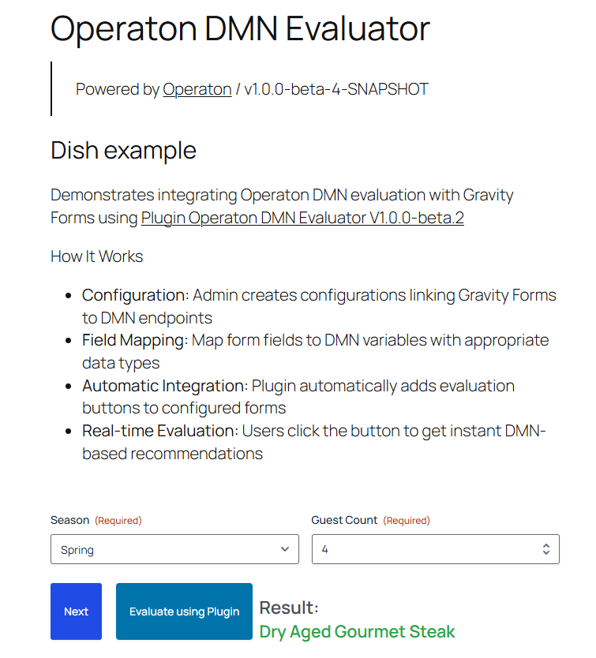

# Operaton DMN WordPress Plugin

A flexible WordPress plugin that integrates Gravity Forms with Operaton DMN decision tables for dynamic form evaluations.

## Plugin Structure

```
operaton-dmn-evaluator/
├── assets/
│   └── css/
│       └── admin.css                    # Admin styles
│       └── frontend.css                 # Frontend styles
│   ├── js/
│   │   └── frontend.js                  # Frontend JavaScript
├── templates/
│   ├── admin-form.php                   # Configuration form page
│   └── admin-list.php                   # Configuration list page
├── operaton-dmn-evaluator.php           # Main plugin file
└── README.md                            # This file
```

## Installation

1. **Create Plugin Directory:**
   ```bash
   cd /wp-content/plugins/
   mkdir operaton-dmn-evaluator
   cd operaton-dmn-evaluator
   ```

2. **Create Required Directories:**
   ```bash
   mkdir -p assets/css assets/js templates
   ```

3. **Add Files:**
   - Copy the main plugin file as `operaton-dmn-evaluator.php`
   - Copy the frontend JavaScript to `assets/js/frontend.js`
   - Create `templates/` directory and add the admin template files
   - Create `templates/` directory and add the admin configuration page files

4. **Activate Plugin:**
   - Go to WordPress Admin → Plugins
   - Find "Operaton DMN Evaluator" and activate it

## Usage

### 1. Create DMN Configuration

1. Go to **Operaton DMN** → **Add Configuration** in WordPress admin
2. Fill in the configuration:
   - **Configuration Name:** Descriptive name for your configuration
   - **Gravity Form:** Select the form to integrate with
   - **DMN Endpoint:** Your Operaton API endpoint (e.g., `https://operatondev.open-regels.nl/engine-rest/decision-definition/key/dish/evaluate`)
   - **Decision Key:** The key of your DMN decision table
   - **Result Field Name:** The output field name from your DMN table
   - **Button Text:** Text for the evaluation button



### 2. Configure Field Mappings

Map your Gravity Form fields to DMN variables:
- **DMN Variable:** The variable name in your DMN table (e.g., `season`, `guestCount`)
- **Form Field ID:** The Gravity Forms field ID (e.g., `1`, `3`)
- **Data Type:** Choose the appropriate data type (String, Integer, Double, Boolean)


### 3. Test Your Configuration

1. Visit your form page
2. Fill in the required fields
3. Click the evaluation button
4. The result will appear below the form

## Features

### ✅ Configurable Integration
- Multiple DMN configurations per WordPress site
- Support for different Operaton endpoints
- Flexible field mapping system

### ✅ Form Integration
- Automatic button injection into Gravity Forms
- Real-time evaluation without page reload
- Result display with customizable styling

### ✅ Data Type Support
- String, Integer, Double, and Boolean data types
- Automatic type conversion for DMN variables
- Validation of required fields

### ✅ Error Handling
- Comprehensive error logging
- User-friendly error messages
- API timeout handling

### ✅ Developer Friendly
- Debug mode for field inspection
- Console logging for troubleshooting
- RESTful API endpoints

## Debug Mode

Add `?operaton_debug=1` to your form page URL to enable debug mode. This will log all form fields to the browser console, helping you identify the correct field IDs for mapping.

## API Endpoints

The plugin creates the following REST API endpoint:
- `POST /wp-json/operaton-dmn/v1/evaluate` - Evaluate form data against DMN

## Requirements

- WordPress 5.0+
- Gravity Forms plugin
- PHP 7.4+
- Access to Operaton DMN engine

## Example Configuration

**DMN Endpoint:**
```
https://operatondev.open-regels.nl/engine-rest/decision-definition/key/dish/evaluate
```

**Field Mappings:**
- `season` → Field ID `1` (String)
- `guestCount` → Field ID `3` (Integer)

**Result Field:** `desiredDish`



Live example url: https://owc-gemeente.open-regels.nl/operaton-dmn-evaluator-2/

## Troubleshooting

### Common Issues

1. **Button Not Appearing:**
   - Check if Gravity Forms is active
   - Verify the form ID in configuration matches your actual form
   - Check browser console for JavaScript errors

2. **Fields Not Found:**
   - Use debug mode to identify correct field IDs
   - Check if field names match Gravity Forms structure
   - Verify field mapping configuration

3. **API Errors:**
   - Check DMN endpoint URL is correct and accessible
   - Verify decision key matches your DMN table
   - Check server error logs for detailed error messages

4. **No Results:**
   - Verify result field name matches DMN output
   - Check DMN table logic and input validation
   - Review API response in browser network tab

### Debug Tips

- Enable WordPress debug mode: `define('WP_DEBUG', true);`
- Check PHP error logs
- Use browser developer tools to inspect network requests
- Add `?operaton_debug=1` to form pages for field debugging

## Security Considerations

- All user inputs are sanitized and validated
- Nonce verification for AJAX requests
- Capability checks for admin functions
- Escaped output to prevent XSS

## License

GPL v2 or later

## Support

For issues and feature requests, please contact your development team or check the plugin documentation.