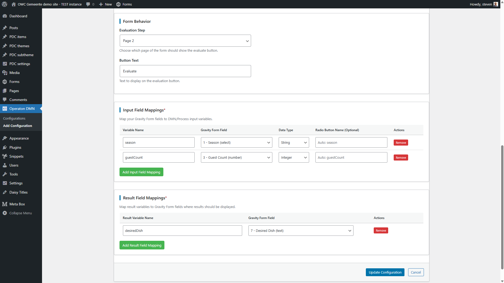

# Operaton DMN Evaluator

The Operaton DMN Evaluator plugin integrates WordPress Gravity Forms with Operaton DMN (Decision Model and Notation) engines to provide real-time decision evaluation capabilities. This guide covers all configuration options and capabilities.

## 📍 Repository Information

### Primary Development Repository
🚀 **Active development happens on GitLab**: [git.open-regels.nl/showcases/operaton-dmn-evaluator](https://git.open-regels.nl/showcases/operaton-dmn-evaluator)

### Public Mirror
📋 **GitHub mirror for visibility**: [github.com/OpenWebconcept/operaton-dmn-evaluator](https://github.com/OpenWebconcept/operaton-dmn-evaluator)

### Where to Go for:

| Need | Location | Link |
|------|----------|------|
| 🐛 **Report Bugs** | GitLab Issues | [Create Issue](https://git.open-regels.nl/showcases/operaton-dmn-evaluator/-/issues/new) |
| ✨ **Feature Requests** | GitLab Issues | [Create Issue](https://git.open-regels.nl/showcases/operaton-dmn-evaluator/-/issues/new) |
| 💾 **Latest Releases** | GitLab Releases | [View Releases](https://git.open-regels.nl/showcases/operaton-dmn-evaluator/-/releases) |
| 🔄 **Auto-Updates** | Configured via GitLab | [Release System](https://git.open-regels.nl/showcases/operaton-dmn-evaluator/-/releases) |

> **Note**: Active development happens on GitLab. GitHub is a read-only mirror for visibility within the OpenWebconcept ecosystem.

## About OpenWebconcept

This plugin is part of the [OpenWebconcept](https://github.com/OpenWebconcept) ecosystem - a collection of WordPress building blocks for government and public sector websites.


## Prerequisites

- WordPress with admin access
- Gravity Forms plugin installed and activated
- Access to an Operaton DMN engine (cloud or self-hosted)
- DMN decision tables deployed on the Operaton engine

---

## Change Log

All notable changes to this project are documented in the [CHANGELOG.md](./CHANGELOG.md).

## Plugin Structure

```
operaton-dmn-evaluator/
├── assets/
│   └── css/
│       └── admin.css                    # Admin styles
│       └── frontend.css                 # Frontend styles
│   ├── images/                          # Images for README & CHANGELOG
│   ├── js/
│   │   └── frontend.js                  # Frontend JavaScript
├── includes/
│   ├── plugin-updater.php               # Plugin updater
│   └── update-debug.php                 # Debug page for update process
├── scripts/
│   ├── create-release.sh                # Creates release package for the plugin
├── templates/
│   ├── admin-form.php                   # Configuration form page
│   └── admin-list.php                   # Configuration list page
├── vendor/plugin-update-checker         # Custom update checker library
├── operaton-dmn-evaluator.php           # Main plugin file
└── README.md                            # This file
```

## Installation

1. **Create Plugin Directory:**
   ```bash
   cd /wp-content/plugins/
   mkdir operaton-dmn-evaluator
   cd operaton-dmn-evaluator
   ```

2. **Download source code as zip:**

   

3. **Extract zip in Plugin Directory:**

4. **Activate Plugin:**
   - Go to WordPress Admin → Plugins
   - Find "Operaton DMN Evaluator" and activate it

# Demo

The familiar [Dish example configured as demo](https://owc-gemeente.open-regels.nl/operaton-dmn-evaluator-2/) shows a multi-step form with a DMN evaluation at the end. The result is displayed in a short popup in the top-right corner of your screen, and the designated field on the form is populated.  


# Configuration Guide

## Plugin Features

### Core Capabilities
- **Real-time DMN Evaluation**: Execute DMN decisions directly from Gravity Forms
- **Multiple Result Fields**: **NEW in v1.0.0-beta.8** - Map multiple DMN result fields to different form fields in a single evaluation
- **Flexible Field Mapping**: Map form fields to DMN variables with type validation
- **Multiple Data Types**: Support for String, Integer, Double, and Boolean types
- **Result Population**: Automatically populate form fields with evaluation results
- **Multi-page Form Support**: Works with single and multi-page Gravity Forms
- **Error Handling**: Comprehensive validation and user-friendly error messages
- **Configuration Management**: Easy-to-use admin interface for managing multiple configurations

### Integration Features
- **Automatic Button Injection**: Evaluation buttons are automatically added to configured forms
- **Form Validation**: Integrates with Gravity Forms validation system
- **Clean State Management**: Results are cleared when form inputs change
- **Visual Feedback**: Success notifications and field highlighting
- **Debug Support**: Comprehensive logging for troubleshooting

## Configuration Settings

### Basic Configuration

Available configurations listed.


Selecting a configuration opens the corresponding dashboard.


#### Configuration Name
- **Purpose**: Descriptive identifier for the configuration
- **Required**: Yes
- **Example**: "Dish Recommendation Engine", "Loan Approval System"

#### Gravity Form Selection
- **Purpose**: Choose which Gravity Form to integrate with DMN evaluation
- **Required**: Yes
- **Note**: Only one configuration per form is allowed
- **Auto-detection**: Field information is automatically loaded when form is selected

### DMN Engine Connection

#### DMN Base Endpoint URL
- **Purpose**: Base URL to your Operaton DMN engine
- **Required**: Yes
- **Format**: Should end with `/engine-rest/decision-definition/key/`
- **Examples**:
  - Operaton Cloud: `https://your-tenant.operaton.cloud/engine-rest/decision-definition/key/`
  - Self-hosted: `https://operatondev.open-regels.nl/engine-rest/decision-definition/key/`
  - Local: `http://localhost:8080/engine-rest/decision-definition/key/`
- **Validation**: URL format is validated and tested
- **Test Feature**: Built-in connection testing available


#### Decision Key
- **Purpose**: The unique identifier of your DMN decision table
- **Required**: Yes
- **Format**: Alphanumeric characters, hyphens, and underscores only
- **Examples**: `dish`, `loan-approval`, `risk-assessment`
- **Note**: Must match the decision key in your deployed DMN model

#### Full Evaluation URL
- **Auto-generated**: `{Base Endpoint URL}{Decision Key}/evaluate`
- **Example**: `https://operatondev.open-regels.nl/engine-rest/decision-definition/key/dish/evaluate`

### Field Mapping Configuration



#### DMN Variable Mapping
Field mappings connect Gravity Form fields to DMN decision table inputs.

**Required Components**:
- **DMN Variable**: Variable name as defined in your DMN table
- **Gravity Forms Field**: Select from available form fields
- **Data Type**: Expected data type for DMN evaluation

**Supported Data Types**:
- **String**: Text values, select options, radio button values
- **Integer**: Whole numbers (validated for numeric format)
- **Double**: Decimal numbers (validated for numeric format)  
- **Boolean**: True/false values (accepts: true, false, 1, 0, yes, no)

**Auto-suggestions**: Data types are automatically suggested based on Gravity Forms field types

**Validation**: 
- Field existence is verified
- Data type compatibility is checked
- Duplicate field usage is prevented

### Result Field Mappings ✨ NEW

#### Multiple Result Configuration
**NEW in v1.0.0-beta.8**: Configure multiple DMN result fields to populate different form fields simultaneously.


#### Result Field Mappings
- **Purpose**: Map multiple DMN output variables to specific form fields
- **Required**: At least one result mapping is required
- **Format**: DMN Result Field Name → Gravity Form Field
- **Examples**: 
  - `aanmerkingHeusdenPas` → Field ID 35
  - `aanmerkingKindPakket` → Field ID 36
  - `loanApproved` → Field ID 10
  - `interestRate` → Field ID 11

**Configuration Benefits**:
- **Single Evaluation**: One DMN call populates multiple result fields
- **Comprehensive Results**: Users see all related decision outcomes immediately
- **Visual Confirmation**: Success notification shows all populated results
- **Individual Targeting**: Each result goes to its specifically configured field

**Example Success Notification**:
```
✅ Results populated (2): aanmerkingHeusdenPas: false, aanmerkingKindPakket: true
```

### Form Behavior Settings

#### Evaluation Step
- **Auto-detect (recommended)**: System determines optimal placement
- **Manual Selection**: Choose specific form step (Step 1, 2, 3, etc.)
- **Current Implementation**: Evaluation button appears on same page as result field

#### Button Text
- **Purpose**: Customize the text displayed on evaluation button
- **Default**: "Evaluate"
- **Examples**: "Get Recommendation", "Check Eligibility", "Calculate Result"

## Form Integration Behavior

### Button Placement
- Evaluation buttons are automatically injected into configured forms
- Buttons appear on the same page as mapped input fields
- Styling matches Gravity Forms theme

### Evaluation Process
1. **Validation**: Form fields are validated before evaluation
2. **Data Collection**: Values are extracted from mapped fields
3. **Type Conversion**: Data is converted to specified DMN types
4. **API Call**: Request is sent to Operaton DMN engine
5. **Result Processing**: Response is parsed and result extracted
6. **Field Population**: Result is populated into designated field
7. **User Feedback**: Success notification is displayed

### State Management
- Results are cleared when form inputs change
- Results are cleared when navigating between form pages
- Fresh evaluation is required after any input modification
- Clean state prevents stale data confusion

## Advanced Features

### Multiple Result Processing ✨ NEW
- **Simultaneous Population**: Single evaluation populates multiple form fields
- **Individual Error Handling**: Each result field is processed independently
- **Comprehensive Feedback**: Success notification lists all populated results
- **Visual Highlighting**: Each populated field is highlighted individually

### Connection Testing
- **Endpoint Validation**: Test connectivity to DMN engine
- **Full Configuration Test**: Validate complete endpoint with decision key
- **Error Diagnosis**: Detailed error messages for troubleshooting

### Debug Support
- **Console Logging**: Comprehensive debug information when WP_DEBUG is enabled
- **Field Detection Debug**: Tools to verify field mapping detection
- **AJAX Response Logging**: Full API request/response logging

### Error Handling
- **Network Errors**: Connection timeout and connectivity issues
- **API Errors**: DMN engine error responses with user-friendly messages
- **Validation Errors**: Field validation with specific error descriptions
- **Configuration Errors**: Setup validation with correction guidance

## Form Design Best Practices

### Result Field Placement
- **Same Page**: Place result fields on same page as evaluate button for immediate feedback
- **Clear Labeling**: Use descriptive labels like "Heusdenpas Eligibility" or "Kindpakket Approval"
- **Field Type**: Use text fields for most results, select fields for predefined options
- **Multiple Results**: **NEW** - Group related result fields together for better UX

### Field Mapping Strategy
- **Required Fields**: Ensure all mapped fields are marked as required in Gravity Forms
- **Data Types**: Choose appropriate data types matching your DMN table expectations
- **Field Order**: Logical flow from input fields to evaluate button to result fields
- **Result Organization**: **NEW** - Organize multiple result fields logically

### User Experience
- **Clear Instructions**: Provide clear form instructions about the evaluation process
- **Progress Indication**: Use form progress bars for multi-step forms
- **Error Messages**: Customize error messages for better user guidance
- **Result Explanation**: **NEW** - Provide context for multiple results when needed

## Troubleshooting

### Common Configuration Issues

**"Configuration error. Please contact the administrator."**
- Check that configuration exists for the form
- Verify form ID matches configuration

**"No result fields found on this page to populate."**
- Add text fields to receive results
- Configure specific result field mappings
- Check field visibility on current page

**"Connection failed" or "Endpoint not found (404)"**
- Verify DMN base endpoint URL format
- Check decision key matches deployed DMN model
- Test network connectivity to DMN engine

### Multiple Result Issues ✨ NEW
**"No field found for result: [field_name]"**
- Verify result field mapping is configured correctly
- Check that target form field exists and is visible
- Ensure field ID matches exactly

**"At least one result field mapping is required"**
- Add at least one result field mapping in admin configuration
- Verify both DMN result field name and target form field are specified

### Field Detection Issues
- Use browser console to debug field detection
- Check field visibility on current page
- Verify field ID mapping in result configuration
- Configure specific field IDs if auto-detection fails

### API Connection Issues
- Verify DMN engine is running and accessible
- Check decision table deployment status
- Validate decision key spelling and case sensitivity
- Review network firewall and security settings

## Example Configurations

### Heusdenpas en Kindpakket (Multiple Results) ✨ NEW
```
Configuration Name: Heusdenpas en Kindpakket
Gravity Form: Social Services Application (ID: 8)
DMN Base Endpoint: https://operatondev.open-regels.nl/engine-rest/decision-definition/key/
Decision Key: HeusdenpasAanvraagEindresultaat
Button Text: Evaluate

Input Field Mappings:
- geboortedatumAanvrager (String) → Birth Date (Field ID: 5)
- aanvragerAlleenstaand (Boolean) → Single Status (Field ID: 33)
- maandelijksBrutoInkomenAanvrager (Integer) → Monthly Income (Field ID: 24)
- aanvragerHeeftKind4Tm17 (Boolean) → Has Children 4-17 (Field ID: 31)

Result Field Mappings:
- aanmerkingHeusdenPas → Heusdenpas Eligibility (Field ID: 35)
- aanmerkingKindPakket → Kindpakket Eligibility (Field ID: 36)

Expected Result: ✅ Results populated (2): aanmerkingHeusdenPas: false, aanmerkingKindPakket: true
```

### Dish Recommendation System (Single Result)
```
Configuration Name: Dish Example
Gravity Form: Dish Selection Form (ID: 2)
DMN Base Endpoint: https://operatondev.open-regels.nl/engine-rest/decision-definition/key/
Decision Key: dish
Result Field Name: desiredDish
Button Text: Get Recommendation

Input Field Mappings:
- season (String) → Season dropdown (Field ID: 1)
- guestCount (Integer) → Guest Count number field (Field ID: 3)

Result Field Mappings:
- desiredDish → Desired Dish text field (Field ID: 7)
```

### Multi-Decision Loan Processing ✨ NEW
```
Configuration Name: Comprehensive Loan Analysis
Gravity Form: Loan Application (ID: 5)
DMN Base Endpoint: https://your-bank.operaton.cloud/engine-rest/decision-definition/key/
Decision Key: comprehensive-loan-evaluation
Button Text: Analyze Loan Application

Input Field Mappings:
- income (Double) → Annual Income (Field ID: 2)
- creditScore (Integer) → Credit Score (Field ID: 3)
- loanAmount (Double) → Requested Amount (Field ID: 4)
- hasCollateral (Boolean) → Collateral Available (Field ID: 5)

Result Field Mappings:
- loanApproved → Approval Status (Field ID: 10)
- interestRate → Interest Rate (Field ID: 11)
- loanTerm → Loan Term Years (Field ID: 12)
- monthlyPayment → Monthly Payment (Field ID: 13)
- riskLevel → Risk Assessment (Field ID: 14)

Expected Result: ✅ Results populated (5): loanApproved: true, interestRate: 3.5, loanTerm: 30, monthlyPayment: 1123.29, riskLevel: medium
```

## Version Information

- **Plugin Version**: 1.0.0-beta.6
- **Gravity Forms Compatibility**: 2.4+
- **WordPress Compatibility**: 5.0+
- **PHP Requirements**: 7.4+

## Support and Documentation

For additional support:
- Check WordPress admin debug logs when WP_DEBUG is enabled
- Use browser developer tools console for frontend debugging
- Review Operaton DMN engine logs for API-related issues
- Consult Operaton DMN documentation for decision table modeling

---

*This guide covers the current beta implementation focusing on same-page result population. Future versions may include additional features such as multi-step result population and advanced field mapping options.*