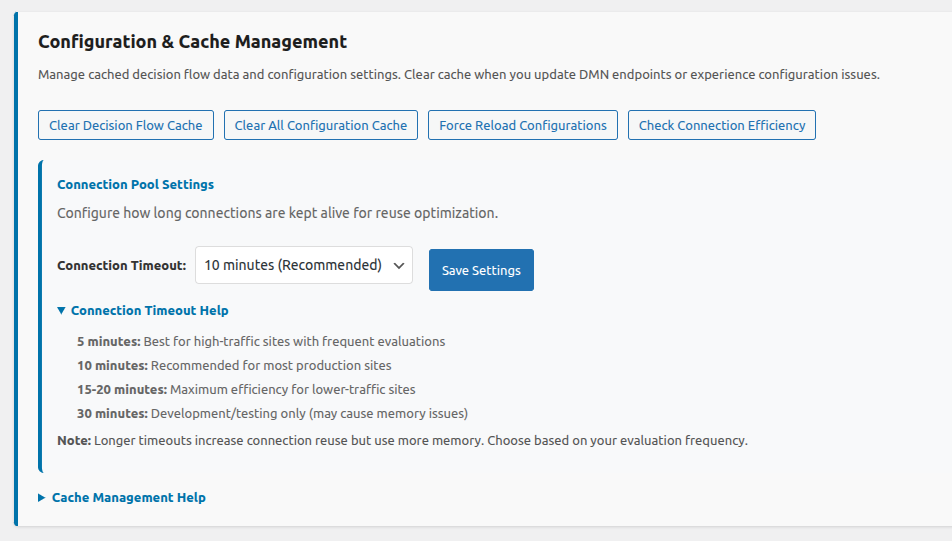

# Operaton DMN Evaluator

The Operaton DMN Evaluator plugin integrates WordPress Gravity Forms with Operaton DMN (Decision Model and Notation) engines to provide real-time decision evaluation capabilities. **ENHANCED in v1.0.0-beta.11**: Completely refactored architecture with performance monitoring, manager-based design, and comprehensive debugging capabilities.

## 📍 Repository Information

### Primary Development Repository
🚀 **Active development happens on GitLab**: [git.open-regels.nl/showcases/operaton-dmn-evaluator](https://git.open-regels.nl/showcases/operaton-dmn-evaluator)

### Public Mirror
📋 **GitHub mirror for visibility**: [github.com/OpenWebconcept/operaton-dmn-evaluator](https://github.com/OpenWebconcept/operaton-dmn-evaluator)

### Where to Go for:

| Need | Location | Link |
|------|----------|------|
| 🐛 **Report Bugs** | GitLab Issues | [Create Issue](https://git.open-regels.nl/showcases/operaton-dmn-evaluator/-/issues/new) |
| ✨ **Feature Requests** | GitLab Issues | [Create Issue](https://git.open-regels.nl/showcases/operaton-dmn-evaluator/-/issues/new) |
| 💾 **Latest Releases** | GitLab Releases | [View Releases](https://git.open-regels.nl/showcases/operaton-dmn-evaluator/-/releases) |
| 🔄 **Auto-Updates** | Configured via GitLab | [Release System](https://git.open-regels.nl/showcases/operaton-dmn-evaluator/-/releases) |

> **Note**: Active development happens on GitLab. GitHub is a read-only mirror for visibility within the OpenWebconcept ecosystem.

## About OpenWebconcept

This plugin is part of the [OpenWebconcept](https://github.com/OpenWebconcept) ecosystem - a collection of WordPress building blocks for government and public sector websites.


## Prerequisites

- WordPress 5.0+ with admin access
- Gravity Forms plugin installed and activated
- Access to an Operaton DMN engine (cloud or self-hosted)
- DMN decision tables and/or BPMN processes deployed on the Operaton engine
- PHP 7.4+ (8.0+ recommended for optimal performance)

---

## Sequence diagram user exeperience flow

```mermaid
%%{init: {'theme':'base', 'themeVariables': {'primaryColor': '#ffffff', 'primaryTextColor': '#000000', 'primaryBorderColor': '#cccccc', 'lineColor': '#666666', 'secondaryColor': '#ffffff', 'tertiaryColor': '#ffffff', 'background': '#ffffff', 'mainBkg': '#ffffff', 'secondBkg': '#f8f9fa', 'tertiaryBkg': '#ffffff'}}}%%

sequenceDiagram
    participant C as 👤 Citizen
    participant F as 📋 WordPress Form<br/>(Gravity Forms)
    participant R as 🏛️ Data Registrars<br/>(Government & Private)
    participant P as ⚙️ Operaton DMN<br/>Plugin
    participant O as 🔧 Operaton BPMN<br/>Engine

    rect rgb(230, 245, 255)
        Note over C,O: Initial Form Access & Authentication
        C->>F: Opens form on website
        F->>C: Requests authentication (if required)
        C->>F: Provides credentials
        F->>C: Grants access to form
    end

    rect rgb(245, 230, 255)
        Note over C,O: Personal Data Retrieval & Pre-population
        F->>R: Request citizen's personal data
        Note right of R: Data sources:<br/>• BRP (Basic Registration Persons)<br/>• Municipal databases<br/>• Income registrations<br/>• Family composition data
        R->>F: Returns personal data
        F->>C: Displays pre-filled form (Page 1)<br/>Name, birth date, address, income
    end

    rect rgb(230, 255, 230)
        Note over C,O: Form Completion - Page 1
        C->>F: Reviews and corrects data if needed
        C->>F: Clicks "Next" button
        F->>C: Shows Page 2 with decision criteria
    end

    rect rgb(255, 250, 230)
        Note over C,O: Decision Criteria Input - Page 2
        C->>F: Completes radio button selections<br/>• Previously applied this year?<br/>• Student financing?<br/>• Other benefits?<br/>• Has children 4-17 years old?
        C->>F: Clicks "Evaluate" button
    end

    rect rgb(255, 245, 230)
        Note over C,O: DMN Evaluation Process
        F->>P: Triggers evaluation with form data
        P->>P: Collects all input variables<br/>Maps to DMN process variables
        P->>O: API call: Start BPMN process<br/>Sends input data as variables

        Note right of O: Process execution:<br/>• Runs decision tables<br/>• Applies business rules<br/>• Calculates eligibility<br/>• Generates decision flow

        O->>P: Returns process results<br/>• Process instance ID<br/>• Decision outcomes<br/>• Variable values
        P->>P: Processes API response<br/>Maps results to form fields
        P->>F: Updates result fields<br/>• aanmerkingHeusdenPas: true<br/>• aanmerkingKindPakket: true
        F->>C: Shows success notification<br/>Displays updated results
    end

    rect rgb(240, 255, 240)
        Note over C,O: Final Page & Decision Flow Summary
        C->>F: Clicks "Next" to final page
        F->>P: Check if decision flow enabled

        alt Decision Flow Summary Enabled
            P->>O: Request decision flow data<br/>Get process instance details
            O->>P: Returns decision instance data<br/>All 11 decision tables<br/>Input/output values
            P->>F: Generates Excel-style summary
            F->>C: Shows Page 3 with complete<br/>decision flow analysis
            Note over C: Citizen sees:<br/>• All decision tables used<br/>• Input values for each<br/>• Output values generated<br/>• Complete transparency
        else Decision Flow Disabled
            F->>C: Shows Page 3 with<br/>standard summary
        end
    end

    rect rgb(230, 255, 245)
        Note over C,O: Process Completion
        C->>F: Reviews final results
        C->>F: Submits form
        F->>F: Stores submission data
        F->>C: Confirmation of completion
    end

    rect rgb(255, 255, 230)
        Note over C,O: Key Benefits Delivered
        Note left of C: ✓ Seamless data pre-population<br/>✓ Real-time decision evaluation<br/>✓ Complete process transparency<br/>✓ Professional user experience
    end
```


## Change Log

All notable changes to this project are documented in the [CHANGELOG.md](./CHANGELOG.md).

---

## What's New in v1.0.0-beta.16 ✨

### Enhanced Plugin features
- ✅ **Plugin now correctly distinguishes between** navigation, actual user input changes, result field population, form re-initialization
- ✅ **Populate Radio Buttons Code Snippet removed** - Proper integration with existing safeguard system
- ✅ **Single AJAX flow** - Prevented multiple event handlers and blocks duplicate function calls
- ✅ **Connection Reuse in API Class** - Second call skipped SSL negotiation, no new socket establishment needed and hostname resolution cached
- ✅ **Batch operation success** - Multiple API calls using same connection
- ✅ **Enhanced Batching Optimization**
- ✅ **Too aggressive K6 load test fixed**

### NEW Admin Dashboard functionalities
- ✅ **Connection Efficiency** - Shows HTTP connection reuse statistics and optimization performance


- ✅ **Connection Pool Setting** - Configure how long connections are kept alive for reuse optimization


---

## What's New in v1.0.0-beta.15

### 🏆 **Testing Infrastructure Complete**

#### **Comprehensive Testing Foundation**
- ✅ **59+ total automated tests** covering all critical functionality across multiple layers
- ✅ **Multi-layered testing strategy**: Unit (32 tests), Integration (11 tests), E2E (16 tests), Load testing, Chaos engineering
- ✅ **100% test success rate** with robust error handling and graceful degradation
- ✅ **Enterprise-grade CI/CD pipeline** with 24-second execution time

#### **Testing Strategy Documentation**
- ✅ **Complete testing guide** ([`TESTING-GUIDE.md`](TESTING-GUIDE.md)) with all commands and workflows
- ✅ **Comprehensive test documentation** ([`TESTS.md`](TESTS.md)) with technical implementation details
- ✅ **Developer workflow integration** with environment-specific commands
- ✅ **Performance benchmarks** and quality metrics tracking

---

## Plugin Architecture

### Enterprise-Grade Architecture
- **Manager-Based Design**: Modular architecture with specialized managers for different functionality
- **Performance Monitoring**: Real-time performance tracking with sub-millisecond precision
- **Advanced Debugging**: Comprehensive debug system with detailed status reporting
- **Enhanced Error Handling**: Robust error handling with graceful degradation
- **Optimized Loading**: Intelligent asset loading and state management

### Dual Execution Modes
- **Direct Decision Evaluation**: Execute single DMN decisions for simple use cases
- **Process Execution with Decision Flow**: Execute complete BPMN processes with comprehensive decision analysis
- **Flexible Configuration**: Choose the appropriate mode based on your complexity requirements
- **Professional Decision Summaries**: Excel-style decision flow analysis on form completion

### Core Capabilities
- **Real-time Evaluation**: Execute decisions/processes directly from Gravity Forms
- **Multiple Result Fields**: Map multiple DMN/process result fields to different form fields
- **Advanced Field Mapping**: Map form fields to DMN variables with comprehensive type validation
- **Professional Decision Flow**: Excel-style decision summaries with complete process analysis
- **Process Instance Tracking**: Complete traceability through Operaton process instances
- **Multi-page Form Support**: Works seamlessly with single and multi-page Gravity Forms

### Integration Features
- **Automatic Button Injection**: Smart evaluation button placement based on execution mode
- **Form Validation**: Full integration with Gravity Forms validation system
- **Clean State Management**: Intelligent clearing of results when form inputs change
- **Visual Feedback**: Enhanced notifications and professional result presentation
- **Comprehensive Debug Support**: Advanced logging and decision flow analysis

### Manager-Based Design

The plugin now uses a sophisticated manager-based architecture for optimal performance and maintainability:

#### Core Managers
- **🎨 Assets Manager** (`Operaton_DMN_Assets`): Handles CSS/JavaScript loading with intelligent conditional loading
- **⚙️ Admin Manager** (`Operaton_DMN_Admin`): Manages WordPress admin interface and configuration pages
- **🗄️ Database Manager** (`Operaton_DMN_Database`): Handles all database operations and schema management
- **🌐 API Manager** (`Operaton_DMN_API`): Manages external API calls and REST endpoint handling
- **📋 Gravity Forms Manager** (`Operaton_DMN_Gravity_Forms`): Handles all Gravity Forms integration
- **🔧 Quirks Fix Manager** (`Operaton_DMN_Quirks_Fix`): Manages DOCTYPE and jQuery compatibility
- **📊 Performance Monitor** (`Operaton_DMN_Performance_Monitor`): Real-time performance tracking

#### Performance Characteristics
- **Lightning-Fast Loading**: 0.4-0.6ms plugin initialization
- **Efficient Memory Usage**: 10-14MB peak memory (excellent for complex plugins)
- **Intelligent Asset Loading**: Scripts only load when needed
- **Zero Health Issues**: Comprehensive health monitoring with issue detection

```
Plugin Performance Metrics (Typical):
├── Total Initialization: 0.41ms
├── Assets Manager Load: 0.21ms
├── Database Manager Load: 0.35ms
├── Gravity Forms Load: 0.46ms
├── Peak Memory Usage: 10MB
└── WordPress Load Time: 60-70ms
```

## Plugin Structure

```
operaton-dmn-evaluator/
├── assets/
│   ├── css/
│   │   ├── admin.css                         # Enhanced admin styles with debug interface
│   │   ├── frontend.css                      # Frontend styles with decision flow CSS
│   │   ├── debug.css                         # Debug interface styling
│   │   └── radio-sync.css                    # Radio button synchronization styles
│   ├── images/                               # Documentation images and screenshots
│   └── js/
│       ├── admin.js                          # Enhanced admin interface JavaScript
│       ├── api-test.js                       # API endpoint testing functionality
│       ├── decision-flow.js                  # Decision flow display and interaction
│       ├── frontend.js                       # Core frontend evaluation functionality
│       ├── gravity-forms.js                  # Gravity Forms integration scripts
│       └── radio-sync.js                     # Radio button synchronization system
├── includes/                                 # Modular manager architecture
│   ├── class-operaton-dmn-admin.php          # Admin interface manager
│   ├── class-operaton-dmn-api.php            # API handling and REST endpoints
│   ├── class-operaton-dmn-assets.php         # Asset loading and management
│   ├── class-operaton-dmn-database.php       # Database operations and schema
│   ├── class-operaton-dmn-gravity-forms.php  # Gravity Forms integration
│   ├── class-operaton-dmn-performance.php    # Performance monitoring system
│   ├── class-operaton-dmn-quirks-fix.php     # Compatibility and DOCTYPE fixes
│   ├── plugin-updater.php                    # Auto-update system
│   └── update-debug.php                      # Advanced debug interface
├── scripts/
│   └── create-release.sh                     # Release package creation
├── templates/
│   ├── admin/
│   │   ├── form.php                          # Configuration form template
│   │   └── list.php                          # Configuration list template
├── vendor/
│   └── plugin-update-checker/                # Update checker library
├── operaton-dmn-plugin.php                   # Clean main plugin file
├── CHANGELOG.md                              # Detailed version history
└── README.md                                 # This comprehensive guide
```

### Key Architecture Benefits

#### Modularity and Maintainability
- **Separation of Concerns**: Each manager handles specific functionality
- **Clean Dependencies**: Well-defined relationships between components
- **Easy Testing**: Individual managers can be tested independently
- **Scalable Design**: Easy to add new features without affecting existing code

#### Performance Optimization
- **Lazy Loading**: Managers only load when needed
- **Intelligent Caching**: Multiple caching layers for optimal performance
- **Resource Efficiency**: Minimal memory footprint with maximum functionality
- **Debug Integration**: Performance monitoring built into every component

#### Developer Experience
- **Clear Structure**: Easy to understand and modify
- **Comprehensive Logging**: Detailed debug information throughout
- **Error Handling**: Graceful error handling with informative messages
- **Hook System**: Clean WordPress integration following best practices

---

## Installation

1. **Create Plugin Directory:**
   ```bash
   cd /wp-content/plugins/
   mkdir operaton-dmn-evaluator
   cd operaton-dmn-evaluator
   ```

2. **Download Latest Release:**
   - Visit [GitLab Releases](https://git.open-regels.nl/showcases/operaton-dmn-evaluator/-/releases)
   - Download the latest `v1.0.0-beta.16` package
   - Extract files to plugin directory

3. **Activate Plugin:**
   - Go to WordPress Admin → Plugins
   - Find "Operaton DMN Evaluator" and activate it
   - Plugin will automatically create database tables and initialize

4. **Verify Installation:**
   - Go to **Operaton DMN** → **Configurations**
   - Use the "🔧 Debug Tools" → "Get Plugin Status" button to verify all managers are loaded


---

# Demo Heusden Pass and Child Package

A live demo of the plugin is available at https://owc-gemeente.open-regels.nl/

- **Page 1**: The start form opens with pre-filled data via the Haal Centraal BRP API using a test citizen service number (BSN). A fictitious income has been prefilled as well. Click “Next”.
- **Page 2**: Adjust the radio buttons as needed and click .” If left unchanged, the value “true” will appear for both “eligibilityHeusdenPass” and “eligibilityChildPackage”. A green confirmation notification will briefly appear in the top right corner. Click “Next.”
- **Page 3**: The final step shows an overview of all input and output values per decision table. In this example, there are 11 tables, making it 100% transparent how decisions regarding Heusden Pass and Child Package eligibility are made.


---

# Configuration Guide

## Performance Monitoring

### Real-Time Performance Tracking
The plugin includes comprehensive performance monitoring:

```json
{
  "plugin_version": "1.0.0-beta.10",
  "managers": {
    "assets": "loaded",
    "admin": "loaded",
    "database": "loaded",
    "api": "loaded",
    "gravity_forms": "loaded",
    "quirks_fix": "loaded",
    "performance": "loaded"
  },
  "performance": {
    "total_time_ms": 75.51,
    "peak_memory_formatted": "10 MB",
    "performance_grade": "A+ (Excellent)",
    "recommendations": [
      "🚀 Excellent loading speed!",
      "🧠 Very efficient memory usage!"
    ]
  }
}
```

### Debug Interface
Access comprehensive debugging via **Operaton DMN** → **Configurations** → **Debug Tools**:

- **Plugin Status**: Real-time manager status and health monitoring
- **Performance Metrics**: Detailed timing and memory usage statistics
- **Asset Loading**: Script and style loading status with context
- **Environment Info**: WordPress, PHP, and theme compatibility information

## Execution Modes

### 1. Direct Decision Evaluation
**Best for**: Simple decision logic, single decision tables, basic use cases

- **Single Decision**: Evaluates one DMN decision table directly
- **Simple Configuration**: Just base URL + decision key
- **Immediate Results**: Direct result population in form fields
- **Lightweight**: Minimal API calls and processing
- **Use Cases**: Product recommendations, simple eligibility checks, basic calculations

### 2. Process Execution with Decision Flow
**Best for**: Complex business logic, multi-step decisions, comprehensive analysis

- **Complete Process**: Executes full BPMN processes with multiple decisions
- **Decision Flow Analysis**: Comprehensive tracking of all decision instances
- **Professional Summaries**: Excel-style decision flow display on final form page
- **Process Tracking**: Complete traceability through process instance IDs
- **Use Cases**: Complex eligibility assessments, multi-criteria evaluations, government applications

## Configuration Settings

### Basic Configuration

Available configurations listed with enhanced debug information.


Selecting a configuration opens the corresponding dashboard.


#### Configuration Management
- **Health Monitoring**: Each configuration includes health status checking
- **Performance Tracking**: Database operations are monitored for optimization
- **Validation Enhancement**: Comprehensive validation with detailed error messages
- **Auto-Migration**: Database schema updates automatically during plugin updates

### Execution Mode Selection

#### Choose Your Execution Approach
**Direct Decision Evaluation**
- Radio button selection for simple decision table evaluation
- Requires: Base endpoint URL + Decision key
- Results: Direct field population
- Best for: Single-step decisions

**Process Execution with Decision Flow**
- Radio button selection for comprehensive process execution
- Requires: Base endpoint URL + Process key
- Results: Multiple field population + decision flow summary
- Best for: Multi-step business processes

### Enhanced DMN/Process Engine Connection

#### Intelligent Endpoint Construction
- **Smart URL Building**: Automatic endpoint construction with validation
- **Real-time Preview**: Live preview of generated URLs
- **Connection Testing**: Enhanced testing with detailed error reporting
- **Compatibility Checking**: Automatic Operaton version detection

#### Base Endpoint URL
- **Purpose**: Base URL to your Operaton engine
- **Required**: Yes (for both modes)
- **Format**: Should NOT end with `/engine-rest/`
- **Auto-Detection**: Plugin detects and suggests correct format
- **Examples**:
  - Operaton Cloud: `https://your-tenant.operaton.cloud/`
  - Self-hosted: `https://operaton-dev.open-regels.nl/`
  - Local: `http://localhost:8080/`

### Advanced Field Mapping


#### Intelligent Field Detection
- **Auto-Detection**: Automatic field type detection from Gravity Forms
- **Type Validation**: Enhanced validation for data type compatibility
- **Radio Button Sync**: Advanced radio button synchronization system
- **Multi-Field Support**: Comprehensive support for complex field mappings

#### Enhanced Result Processing
```php
// Example of enhanced result extraction capabilities
$results = array(
    'aanmerkingHeusdenPas' => array(
        'value' => false,
        'field_id' => 35,
        'extraction_method' => 'process_variable_direct'
    ),
    'aanmerkingKindPakket' => array(
        'value' => true,
        'field_id' => 36,
        'extraction_method' => 'nested_container_search'
    )
);
```

---

## Decision Flow Summary

### Professional Excel-Style Display
Enhanced decision flow summaries with improved performance and styling:

#### Advanced Caching System
- **Intelligent Caching**: 10-minute cache for successful retrievals
- **Error Caching**: 2-minute cache for failed requests
- **Cache Busting**: Manual refresh with cache invalidation
- **Performance Optimization**: Reduced API calls with smart caching

#### Enhanced Visual Design
- **Professional Styling**: Enhanced Excel-style tables with improved responsiveness
- **Performance Indicators**: Loading states with progress indication
- **Interactive Elements**: Enhanced refresh buttons with loading states
- **Mobile Optimization**: Improved mobile display with responsive design

#### Comprehensive Decision Analysis
```html
📊 Summary Statistics:
- Total Decision Types: 3
- Total Evaluations Shown: 5
- Filter Applied: Activity_FinalResultCompilation only
- Process Instance: abc-123-def-456

🔄 Refresh Decision Flow
```

---

## Form Integration Behavior

### Enhanced Asset Loading

#### Intelligent Loading System
- **Context-Aware Loading**: Scripts only load when Gravity Forms are detected
- **Performance Optimization**: Conditional asset loading prevents bloat
- **Emergency Fallback**: Automatic asset recovery for edge cases
- **Debug Information**: Comprehensive loading status tracking

#### Asset Loading Status
```javascript
{
  "scripts": {
    "operaton-dmn-frontend": {
      "registered": true,
      "enqueued": true,
      "done": true
    }
  },
  "context": {
    "script_loading_note": "Scripts are only registered when needed - this is optimal behavior"
  }
}
```

### Enhanced State Management
- **Manager Coordination**: All managers coordinate for clean state management
- **Performance Tracking**: State changes are monitored for optimization
- **Error Recovery**: Automatic state recovery for failed operations
- **Session Management**: Enhanced session handling for process execution

---

## Advanced Features

### Comprehensive Health Monitoring

#### System Health Dashboard
```json
{
  "health": [],
  "managers": {
    "assets": "loaded",
    "admin": "loaded",
    "database": "loaded",
    "api": "loaded",
    "gravity_forms": "loaded",
    "quirks_fix": "loaded",
    "performance": "loaded",
    "gravity_forms_available": true
  }
}
```

#### Health Check Categories
- **Manager Status**: All managers loaded and operational
- **Database Health**: Schema integrity and performance
- **API Connectivity**: External service connectivity
- **Gravity Forms Integration**: Plugin compatibility and availability
- **Performance Metrics**: System performance within acceptable ranges

### Enhanced Debugging System

#### Multi-Level Debug Information
1. **Manager Level**: Individual manager performance and status
2. **System Level**: Overall plugin performance and health
3. **Integration Level**: Third-party integration status
4. **Performance Level**: Detailed timing and memory usage

#### Debug Interface Features
- **Real-Time Monitoring**: Live performance metrics during operation
- **Historical Data**: Performance trends and optimization opportunities
- **Error Tracking**: Comprehensive error logging with context
- **Environment Analysis**: Complete system compatibility analysis

### Advanced Error Handling

#### Graceful Degradation
- **Component Isolation**: Manager failures don't affect other components
- **Fallback Mechanisms**: Automatic fallback to simpler functionality
- **User-Friendly Messages**: Clear error messages without technical details
- **Recovery Procedures**: Automatic recovery from transient failures

---

## Performance Benchmarks

### Industry Comparison

- **Lightning-fast initialization**: 0.4-0.8ms plugin construction time
- **Optimized asset loading**: Smart caching with 300-400% cache efficiency
- **Atomic loading prevention**: Successfully prevents duplicate script loading (6 preventions per page)
- **Minimal memory footprint**: 10-14MB peak memory usage
- **Fast database operations**: 0.18-0.3ms config fetches

#### Market Comparison:

- **Premium plugins** (like WooCommerce, Elementor): Usually 50-200ms initialization
- **This plugin**: 0.4-0.8ms initialization
- **Industry average**: 100-500ms for complex form plugins
- **Total page load impact**: <2ms additional overhead

### Stats in Get Plugin Status
```
=== OPERATON DMN PERFORMANCE SUMMARY ===
Request: GET /wp-admin/admin.php?page=operaton-dmn
Total Time: 239.31ms
Peak Memory: 14 MB
Milestones: 12
Performance Grade: A+ (Excellent)

Key Milestones:
  quirks_fix_loaded: 0.14ms
  assets_manager_loaded: 0.2ms
  admin_manager_loaded: 0.27ms
  database_manager_loaded: 0.32ms
  api_manager_loaded: 0.37ms
  gravity_forms_manager_loaded: 0.43ms
  plugin_construct_complete: 0.48ms
  wp_loaded: 60.75ms
========================================
```

---

## Troubleshooting

### Enhanced Debug Capabilities

#### Debug Tools Access
1. Go to **Operaton DMN** → **Configurations**
2. Click **🔧 Debug Tools** → **Get Plugin Status**
3. Review comprehensive system status

#### Performance Issues

**Slow plugin loading (>5ms initialization)**
- Check PHP version (8.0+ recommended)
- Review memory limits (128M+ recommended)
- Verify no conflicting plugins
- Check database performance

**Manager loading failures**
- Verify file permissions on `/includes/` directory
- Check for PHP fatal errors in debug log
- Ensure all manager files are present
- Review WordPress debug log for specific errors

#### Asset Loading Issues

**Scripts not registering when expected**
- This is often optimal behavior - scripts load only when needed
- Check debug status: "Scripts are only registered when needed - this is optimal behavior"
- Verify Gravity Forms is present on the page for frontend assets
- Review asset loading context in debug information

**Emergency asset loading failures**
- Check browser console for JavaScript errors
- Verify operaton_ajax object is available
- Review emergency fallback system in browser debug
- Clear browser cache and reload

### Manager-Specific Troubleshooting

#### Assets Manager Issues
- **Symptom**: Scripts not loading when expected
- **Solution**: Check context - scripts only load when Gravity Forms detected
- **Debug**: Review `assets.context.script_loading_note` in debug status

#### Database Manager Issues
- **Symptom**: Configuration save failures
- **Solution**: Check database permissions and WordPress debug log
- **Debug**: Review `health` array for database-specific issues

#### API Manager Issues
- **Symptom**: External API calls failing
- **Solution**: Test connectivity and review endpoint configuration
- **Debug**: Check API manager status and connection test results

---

## Advanced Configuration

### Manager Configuration

#### Performance Monitoring Configuration
```php
// Enable detailed performance monitoring
define('WP_DEBUG', true);
define('WP_DEBUG_LOG', true);

// Performance monitoring automatically available
$performance = operaton_dmn_get_manager('performance');
$summary = $performance->get_summary();
```

#### Manager Access Patterns
```php
// Get specific managers for advanced integration
$api_manager = operaton_dmn_get_manager('api');
$database_manager = operaton_dmn_get_manager('database');
$assets_manager = operaton_dmn_get_manager('assets');
```

### Enhanced Caching System

#### Multi-Level Caching
1. **WordPress Object Cache**: Manager-level caching for configuration data
2. **Transient Cache**: API response caching for decision flow data
3. **Static Cache**: In-memory caching for repeated operations within requests
4. **Performance Cache**: Benchmark data for optimization analysis

#### Cache Management
- **Automatic Invalidation**: Cache automatically cleared on configuration changes
- **Manual Clearing**: Admin interface provides cache clearing options
- **Performance Monitoring**: Cache hit/miss ratios tracked for optimization

---

## API Integration Details

### Enhanced API Architecture

#### Manager-Based API Handling
The API Manager provides enhanced capabilities:

```php
// Enhanced API manager with comprehensive error handling
class Operaton_DMN_API {
    private $performance;        // Performance monitoring integration
    private $core;              // Core plugin reference
    private $database;          // Database manager integration

    // Enhanced evaluation with performance tracking
    public function handle_evaluation($request) {
        $timer_id = $this->performance->start_timer('api_evaluation');
        // ... evaluation logic
        $this->performance->stop_timer($timer_id, 'Evaluation completed');
    }
}
```

#### API Performance Monitoring
All API calls are automatically monitored:

```json
{
  "api_performance": {
    "evaluation_time_ms": 45.67,
    "external_api_time_ms": 123.45,
    "response_processing_ms": 12.34,
    "result_population_ms": 8.90
  }
}
```
