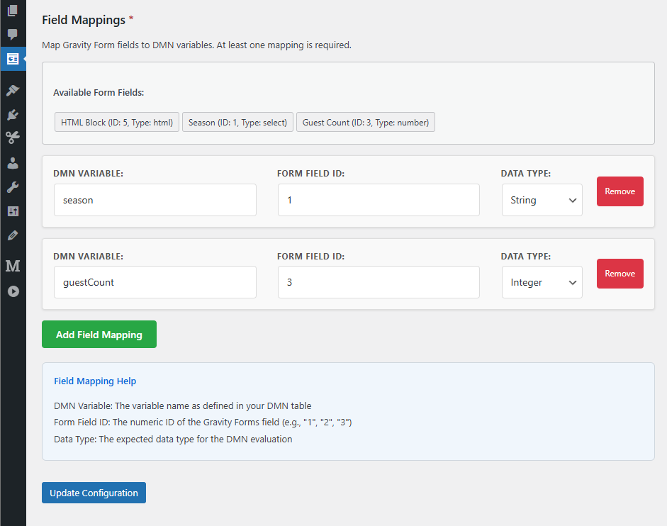

# Operaton DMN Evaluator

A flexible WordPress plugin that integrates Gravity Forms with Operaton DMN decision tables for dynamic form evaluations.

## 📍 Repository Information

### Primary Development Repository
🚀 **Active development happens on GitLab**: [git.open-regels.nl/showcases/operaton-dmn-evaluator](https://git.open-regels.nl/showcases/operaton-dmn-evaluator)

### Public Mirror
📋 **GitHub mirror for visibility**: [github.com/OpenWebconcept/operaton-dmn-evaluator](https://github.com/OpenWebconcept/operaton-dmn-evaluator)

### Where to Go for:

| Need | Location | Link |
|------|----------|------|
| 🐛 **Report Bugs** | GitLab Issues | [Create Issue](https://git.open-regels.nl/showcases/operaton-dmn-evaluator/-/issues/new) |
| ✨ **Feature Requests** | GitLab Issues | [Create Issue](https://git.open-regels.nl/showcases/operaton-dmn-evaluator/-/issues/new) |
| 💾 **Latest Releases** | GitLab Releases | [View Releases](https://git.open-regels.nl/showcases/operaton-dmn-evaluator/-/releases) |
| 🔄 **Auto-Updates** | Configured via GitLab | [Release System](https://git.open-regels.nl/showcases/operaton-dmn-evaluator/-/releases) |

> **Note**: Active development happens on GitLab. GitHub is a read-only mirror for visibility within the OpenWebconcept ecosystem.

## About OpenWebconcept

This plugin is part of the [OpenWebconcept](https://github.com/OpenWebconcept) ecosystem - a collection of WordPress building blocks for government and public sector websites.


---

## Change Log

[[1.0.0-beta.4] - 2025-07-07](./CHANGELOG.md#100-beta4---2025-07-07)<br>
[[1.0.0-beta.3] - 2025-07-01](./CHANGELOG.md#100-beta3---2025-07-01)<br>

All notable changes to this project are documented in the [CHANGELOG.md](./CHANGELOG.md).

## Plugin Structure

```
operaton-dmn-evaluator/
├── assets/
│   └── css/
│       └── admin.css                    # Admin styles
│       └── frontend.css                 # Frontend styles
│   ├── images/                          # Images for README & CHANGELOG
│   ├── js/
│   │   └── frontend.js                  # Frontend JavaScript
├── includes/
│   ├── plugin-updater.php               # Plugin updater
│   └── update-debug.php                 # Debug page for update process
├── scripts/
│   ├── create-release.sh                # Creates release package for the plugin
├── templates/
│   ├── admin-form.php                   # Configuration form page
│   └── admin-list.php                   # Configuration list page
├── vendor/plugin-update-checker         # Custom update checker library
├── operaton-dmn-evaluator.php           # Main plugin file
└── README.md                            # This file
```

## Installation

1. **Create Plugin Directory:**
   ```bash
   cd /wp-content/plugins/
   mkdir operaton-dmn-evaluator
   cd operaton-dmn-evaluator
   ```

2. **Download source code as zip:**

   

3. **Extract zip in Plugin Directory:**

4. **Activate Plugin:**
   - Go to WordPress Admin → Plugins
   - Find "Operaton DMN Evaluator" and activate it

## Usage

### 1. Create DMN Configuration

1. Go to **Operaton DMN** → **Add Configuration** in WordPress admin
2. Fill in the configuration:
   - **Configuration Name:** Descriptive name for your configuration
   - **Gravity Form:** Select the form to integrate with
   - **DMN Endpoint:** Your Operaton API endpoint (e.g., `https://operatondev.open-regels.nl/engine-rest/decision-definition/key/dish/evaluate`)
   - **Decision Key:** The key of your DMN decision table
   - **Result Field Name:** The output field name from your DMN table
   - **Button Text:** Text for the evaluation button


### 2. Configure Field Mappings

Map your Gravity Form fields to DMN variables:
- **DMN Variable:** The variable name in your DMN table (e.g., `season`, `guestCount`)
- **Form Field ID:** The Gravity Forms field ID (e.g., `1`, `3`)
- **Data Type:** Choose the appropriate data type (String, Integer, Double, Boolean)



### 3. Test Your Configuration

1. Visit your form page
2. Fill in the required fields
3. Click the evaluation button
4. The result will appear below the form

## Features

### ✅ Configurable Integration
- Multiple DMN configurations per WordPress site
- Support for different Operaton endpoints
- Flexible field mapping system

### ✅ Form Integration
- Automatic button injection into Gravity Forms
- Real-time evaluation without page reload
- Result display with customizable styling

### ✅ Data Type Support
- String, Integer, Double, and Boolean data types
- Automatic type conversion for DMN variables
- Validation of required fields

### ✅ Error Handling
- Comprehensive error logging
- User-friendly error messages
- API timeout handling

### ✅ Developer Friendly
- Debug mode for field inspection
- Console logging for troubleshooting
- RESTful API endpoints

## Debug Mode

Add `?operaton_debug=1` to your form page URL to enable debug mode. This will log all form fields to the browser console, helping you identify the correct field IDs for mapping.

## API Endpoints

The plugin creates the following REST API endpoint:
- `POST /wp-json/operaton-dmn/v1/evaluate` - Evaluate form data against DMN

## Requirements

- WordPress 5.0+
- Gravity Forms plugin
- PHP 7.4+
- Access to Operaton DMN engine

## Example Configuration

**DMN Endpoint:**
```
https://operatondev.open-regels.nl/engine-rest/decision-definition/key/dish/evaluate
```

**Field Mappings:**
- `season` → Field ID `1` (String)
- `guestCount` → Field ID `3` (Integer)

**Result Field:** `desiredDish`


Live example url: https://owc-gemeente.open-regels.nl/operaton-dmn-evaluator-2/

## Troubleshooting

### Common Issues

1. **Button Not Appearing:**
   - Check if Gravity Forms is active
   - Verify the form ID in configuration matches your actual form
   - Check browser console for JavaScript errors

2. **Fields Not Found:**
   - Use debug mode to identify correct field IDs
   - Check if field names match Gravity Forms structure
   - Verify field mapping configuration

3. **API Errors:**
   - Check DMN endpoint URL is correct and accessible
   - Verify decision key matches your DMN table
   - Check server error logs for detailed error messages

4. **No Results:**
   - Verify result field name matches DMN output
   - Check DMN table logic and input validation
   - Review API response in browser network tab

### Debug Tips

- Enable WordPress debug mode: `define('WP_DEBUG', true);`
- Check PHP error logs
- Use browser developer tools to inspect network requests
- Add `?operaton_debug=1` to form pages for field debugging

## Security Considerations

- All user inputs are sanitized and validated
- Nonce verification for AJAX requests
- Capability checks for admin functions
- Escaped output to prevent XSS
